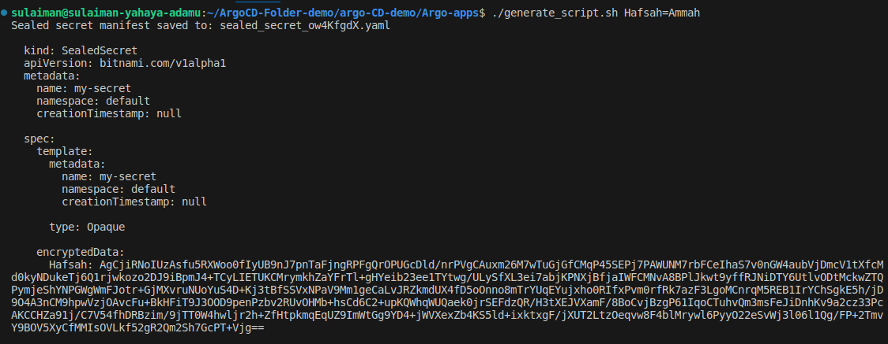
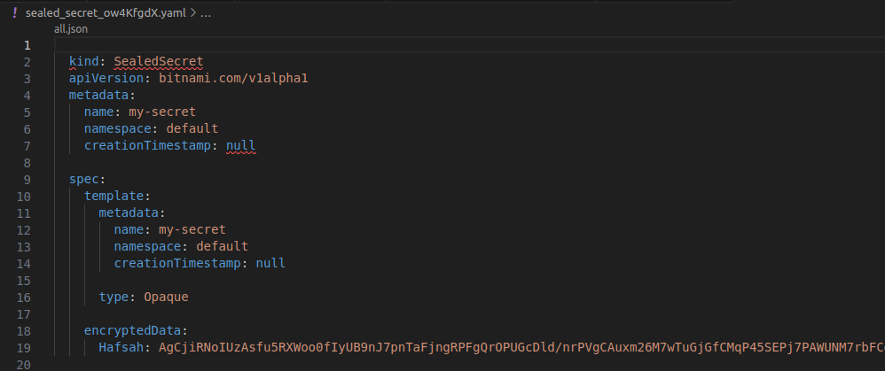
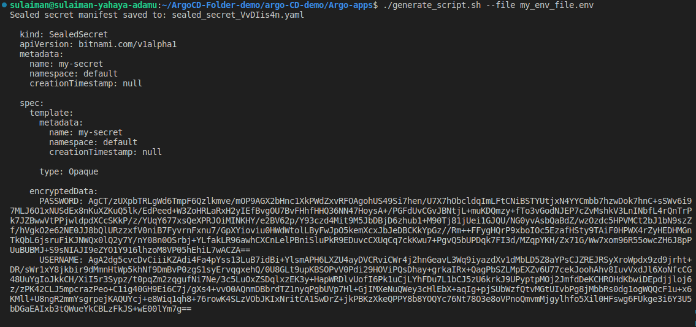
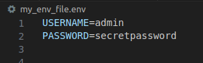

# Sealed Secret Generator for Kubernetes

## Introduction

The Bash script automates the generation of Sealed Secrets for a Kubernetes cluster. It accepts either key-value pairs provided directly via the command line or a file path to an `.env` file containing multiple key-value pairs.

## Requirements

- Basic programming skills e.g Python or Bash we used bash in this scenario 
- Access to a Kubernetes cluster with Sealed Secrets installed, Kind/Minikube is acceptable. Minikube was our enviroment of choice.

## Prerequisites
1. Ensure `kubeseal` is installed and configured correctly on your local machine. Refer to the [Kubeseal documentation](https://github.com/bitnami-labs/sealed-secrets#sealed-secrets) for installation instructions. Use the command ```kubeseal --version``` to confirm. 
2. Set up access to your Kubernetes cluster. Make sure you have the necessary permissions to create and manage Secrets.

### Running the Script

1. Clone this repository or download the `generate_sealed_secret.sh` script.
2. Make the script executable:
   ```bash
   chmod +x generate_sealed_secret.sh


# Secure Your Kubernetes Secrets with Sealed Secrets

Welcome to the realm of Kubernetes security, where we embark on a journey to protect our secrets with the powerful Sealed Secrets tool. In this guide, we'll walk you through the process of generating Sealed Secrets for your Kubernetes cluster, ensuring your sensitive information remains safe from prying eyes.

## Prerequisites

Before we begin, make sure you have the following:

- Basic familiarity with python or Bash scripting.
- Access to a Kubernetes cluster with [Sealed Secrets](https://github.com/bitnami-labs/sealed-secrets?tab=readme-ov-file#linux) installed. We would be using minkube for the purpose of this project.
- Ensure `kubeseal` is installed and configured correctly on your local machine. Refer to the [Kubeseal documentation](https://github.com/bitnami-labs/sealed-secrets#sealed-secrets) for installation instructions. Use the command ```kubeseal --version``` to confirm.

## Getting Started

Let's dive into the process of generating Sealed Secrets step by step:

### Step 1: Obtain the Script

First, download the `generate_script.sh` script or clone this repository to get started.
```bash
#!/bin/bash

# Function to create a Kubernetes Secret manifest
create_secret_manifest() {
    cat <<EOF
apiVersion: v1
kind: Secret
metadata:
  name: $1
type: Opaque
data:
EOF
    while IFS= read -r line; do
        key=$(echo "$line" | cut -d= -f1)
        value=$(echo "$line" | cut -d= -f2-)
        if [ -n "$key" ] && [ -n "$value" ]; then
            encoded_value=$(echo -n "$value" | base64)
            echo "  $key: $encoded_value"
        fi
    done < "$2"
}

# Function to seal the Kubernetes Secret manifest using kubeseal
seal_secret_manifest() {
    kubeseal --controller-namespace argocd --controller-name sealed-secrets
}

# Generate a random filename for the sealed secret manifest
random_file=$(mktemp -u sealed_secret_XXXXXXXX.yaml)

# Parse command line arguments
if [ $# -eq 0 ]; then
    echo "Usage: $0 [KEY1=VALUE1 [KEY2=VALUE2 ...]] | --file <env_file>"
    exit 1
elif [ "$1" = "--file" ]; then
    if [ $# -ne 2 ]; then
        echo "Usage: $0 [KEY1=VALUE1 [KEY2=VALUE2 ...]] | --file <env_file>"
        exit 1
    fi
    create_secret_manifest "my-secret" "$2" | seal_secret_manifest > "$random_file"
else
    create_secret_manifest "my-secret" <(echo "$@") | seal_secret_manifest > "$random_file"
fi

# Remove the brackets and quotes from the saved file
sed -i 's/{//g; s/}//g; s/"//g; s/,//g' "$random_file"

# Output the random filename
echo "Sealed secret manifest saved to: $random_file"

# Output the content of the file
cat "$random_file"
```
#### How the Script Works
- Function Definitions
  - create_secret_manifest constructs a Kubernetes Secret manifest using provided key-value pairs or an .env file.

  - seal_secret_manifest seals the Kubernetes Secret manifest using kubeseal, ensuring secure encryption.

- Random Filename Generation
  - The script generates a unique filename for the sealed secret manifest to ensure security and avoid conflicts.
- Parsing Command Line Arguments
  - The script checks the provided command line arguments to determine the source of the secret data. if no arguments are provided, it displays usage instructions.
  - If the --file option is used, it expects a filename as the second argument and generates a sealed secret manifest from the contents of the specified file.
  - If key-value pairs are provided directly, it generates a sealed secret manifest from these pairs.
- Execution
  - After generating the sealed secret manifest, the script cleans up the file's formatting and displays the path to the saved file, making it easy to locate.
  - It then ouputs the content of the file saved to the console.

### Step 2: Prepare the Script

Make the script executable using the following command:

```bash
chmod +x generate_script.sh
```
### Step 3:Generate Sealed Secrets
You can provide key-value pairs directly via the command line. Here's how:
```bash 
generate_script.sh KEY1=VALUE1 KEY2=VALUE2 ....
```



Using an .env File 
``` bash
generate_script.sh --file my_env_file.env
```



NB: We created a sample .env file "my_env_file.env" 


## Conclusion
By following these steps, you can seamlessly generate and deploy Sealed Secrets to protect your Kubernetes secrets, ensuring the security of your applications and data. Happy sealing!
