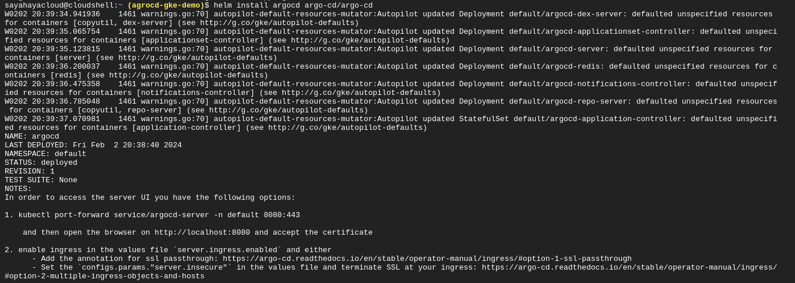

# Deploying an NGINX application with GKE using ArgoCD and Helm Charts

## Introduction 
Deploying an application with Google Kubernetes Engine (GKE) using ArgoCD and Helm Charts involves utilizing Kubernetes for container orchestration, ArgoCD for GitOps-based deployment, and Helm Charts for packaging and managing Kubernetes applications. 

To achieve this, we will be going through the following steps:


## Create a Kubernetes cluster using GKE

### Login & Configure Project Info
```sh
$ gcloud auth login 
$ gcloud config set project <PROJECT_ID>
$ gcloud config set compute/region <COMPUTE_REGION>
```
### create a cluster and get cluster credntials  (autopilot)
The cluster name and project are 'demo-cluster' and 'agrocd-gke-demo' respectively.
```sh
 $ gcloud container clusters create-auto demo-cluster \
    --region us-west1 \
    --project=agrocd-gke-demo
 $ gcloud container clusters get-credentials demo-cluster --region us-west1 --project=agrocd-gke-demo
```


You can see the cluster been created on the cloud console 


[Read more on creating an autopilot GKE cluster](https://cloud.google.com/kubernetes-engine/docs/how-to/creating-an-autopilot-cluster)


## Deploy ArgoCD to the cluster and expose the service 

### Add Argo CD Helm repository
To add the Argo CD Helm repository to your local Helm configuration, you can use the following commands: 
```sh
 $ helm repo add argo-cd https://argoproj.github.io/argo-helm
 $ helm repo update
```


This adds the Argo CD Helm repository with the name argo-cd and points it to the official Argo CD Helm charts repository.

After running these commands, you can search for Argo CD charts and install them using Helm. For example, to search for available Argo CD charts, you can use:
```sh
helm search repo argo-cd
```

### Deploy ArgoCD using its Helm Chart
To install Argo CD, you can use a command like this:
```sh
helm install argo-cd argo-cd/argo-cd
```



### Expose the service
To make it accessible from outside the cluster, allowing external users or systems to interact with the application or service. This can be done by using the Nodeport, Loadbalancer or Ingress. We will be exposing this service using a loadbalancer with the command below:

```sh
$ kubectl patch svc argocd-server -p '{"spec": {"type": "LoadBalancer"}}'
```


An external ip has been created. This exposes Argo CD to the web.


### Login to Argo CD
Argo CD web UI using the external IP or domain assigned to the Argo CD service and log in with the default username (admin) and initial password obtained from the server logs with this command :
```sh
 kubectl get secret argocd-initial-admin-secret -o jsonpath="{.data.password}" | base64 -d; echo
```


Hence you've reached the Argo CD landing page.


## Connect to the Github Repo


### Setting up github repo
To integrate a GitHub repository with Argo CD via the web UI, navigate to the Settings tab. Within the Repositories section, choose Connect Repo using HTTPS or SSH. Here, we used HTTPS.
Input the GitHub repository URL and provide the necessary authentication details.


### Syncing Argo CD to your repo
A directory/folder in this repo will be created to point our Argo CD configuration. Argo CD will listen and sync any changes to the manifest files created here.

## Deploying Applications (In our Case NGINX )

## Configure Argo CD
Argo CD manages and synchronizes applications with their Git definitions. Customize them based on your deployment and maintenance requirements. 


- Application Name:
Choose a unique name for your application. In this example, 'argo' is used suggested as a convention for the root or main application.

- Project Name:
Specify the Argo CD project name. By default, it's 'default', but you can customize projects to organize and control activities.

- Sync Policy:
Determine the synchronization policy, whether it should sync automatically ('Automatic') or manually ('Manual') from its source. It's set to 'Manual' by default.

- Prune Resources:
Check this option if you want Argo CD to delete resources on the cluster that are no longer defined in Git. By default, it's unchecked.

- Self Heal:
Check this option if you want Argo CD to force the state defined in Git to the cluster, even when the cluster state is different. It ensures alignment.

- Set Deletion Finalizer:
Check this option if you want to add a deletion finalizer to the app. This finalizer deletes both the app and associated resources on the cluster when they are no longer defined in Git.


- Repository URL:
Set the Git repository URL previously configured for your application's manifests.

- Revision:
Specify the Git branch or tag that represents the desired version of your application. Different apps can be set up for different branches or tags based on specific requirements.

- Path:
Define the path within the Git repository where Argo CD should watch for manifest files. This is the directory structure where your Kubernetes manifests are stored. If you've organized manifests into a specific folder, point Argo CD to that path.

- Cluster URL:
Specify the URL of the destination Kubernetes cluster. Typically, this is set to the default cluster, and you would use the Kubernetes API server URL.

- Namespace:
Set the destination namespace in the cluster where you want the application to be deployed. Define the Kubernetes namespace where your application resources should be created.


### Deploying NGINX 
- Locating an NGINX Helm chart. Here we used [artifact hub](https://artifacthub.io/.) to search for the NGINX Helm chart used [nginx](https://artifacthub.io/packages/helm/bitnami/nginx)
use this command to install:
```sh
helm install my-release oci://registry-1.docker.io/bitnamicharts/nginx
```


- Prepare a manifest file and push to the folder you pointed to in the Argo CD cofiguration. 
  


```sh
apiVersion: argoproj.io/v1alpha1
kind: Application
metadata:
  name: nginx
  namespace: default
  finalizers:
    - resources-finalizer.argocd.argoproj.io
spec:
  destination:
    namespace: nginx
    server: https://kubernetes.default.svc
  project: default
  source:
    chart: nginx
    repoURL: https://charts.bitnami.com/bitnami
    targetRevision: 15.10.2
  syncPolicy:
    automated:
      prune: true
      selfHeal: true
    syncOptions:
    - CreateNamespace=true
```
The YAML file is a Kubernetes manifest for an Argo CD Application. It defines how Argo CD should manage the deployment of an application named "nginx" in the Kubernetes cluster. Let's break down the key values:
- apiVersion and kind: These fields specify the Kubernetes API version and kind of the resource, indicating that it's an Argo CD Application.

- metadata: Metadata about the application including its name, namespace (within Argo CD), and finalizers (which deletes resources on both Argo CD and the k8s cluster when it is removed from Git)

- destination: Specifies the target destination where the application will be deployed.
- namespace: The Kubernetes namespace where the application resources will be created (in this case, "nginx").
- server: The Kubernetes API server URL (in this case, the default service in the "default" namespace).

- project: Indicates the Argo CD project to which the application belongs. In this case, it's the default project.

- source: Describes the source of the application's manifests.
  - chart: Specifies the Helm chart name ("nginx" in this case).
  - repoURL: Specifies the Helm chart repository URL (Bitnami's public chart repository in this case).
  - targetRevision: Specifies the version or revision of the Helm chart to use (version "15.10.2" in this case).
- syncPolicy: Defines the synchronization policy for the application.
  - automated: Specifies automated synchronization settings.
    - prune: If set to true, Argo CD will delete Kubernetes resources that are no longer defined in the source repository.
    - selfHeal: If set to true, Argo CD will attempt to reconcile the actual state in the cluster with the desired state defined in the source repository.
  - syncOptions: Additional options passed to the synchronization process. In this case, it includes CreateNamespace=true, which means Argo CD will create the target namespace if it doesn't exist.  

  


  


# Testing the Fast API
## Deploying nginx using [FastAPI](https://argocd-api-htgvvmv22a-ew.a.run.app/docs)
We used the source code of our application to deploy on Argo CD using the FAST API interface.


We can see the nginx app successfully created on the Argo CD UI


## Conclusion

We were able to deploy an NGINX application with Google Kubernetes Engine (GKE) using ArgoCD and Helm Charts. This offers a streamlined and automated approach to managing Kubernetes deployments. Leveraging ArgoCD's GitOps principles and Helm Charts simplifies the deployment process, ensuring consistency and reliability in application delivery on GKE clusters. We also succesfully tested the FAST API interface to deploy the nginx app on Argo CD. This integration empowers teams to efficiently deploy and manage applications.